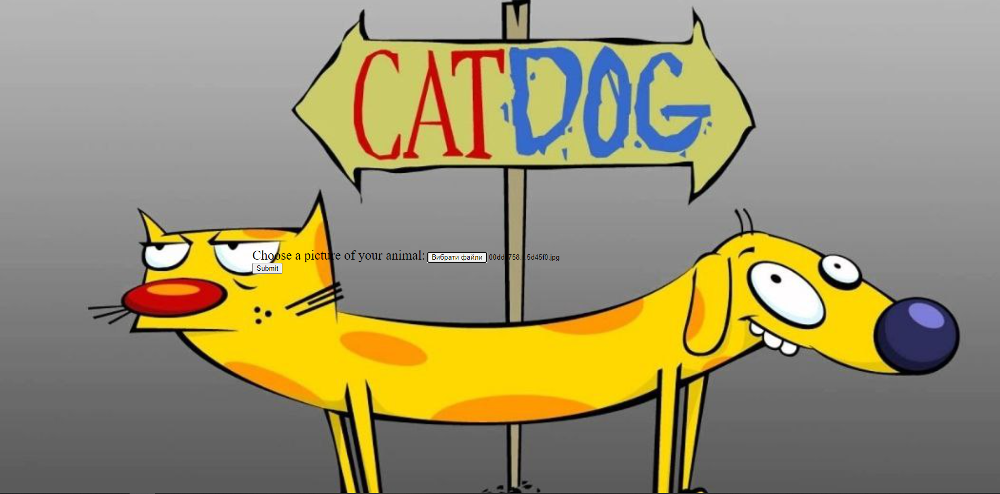
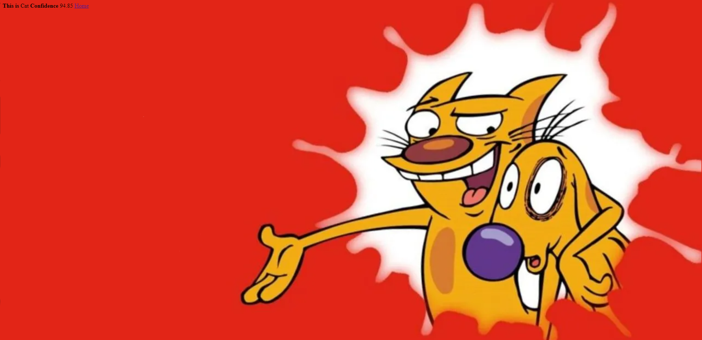

# python classification web app

## Install project

```shell
git clone https://github.com/Quadrod/python_classification_web_app
cd python_classification_web_app
python -m venv venv
source venv/bin/activate # on MacOS
venv\Scripts\activate # on Windows
pip install -r requirements.txt
flask --app back/app run
```

## Demo



## Links
### Keras model
https://colab.research.google.com/drive/1pDrr1MTjoRNgoUfGTJfX5-aDSh8BhAka?usp=sharing

### Dataset 
https://www.kaggle.com/datasets/kdsharmaai/cat-and-dog-1k-images-dataset?select=Dog2
